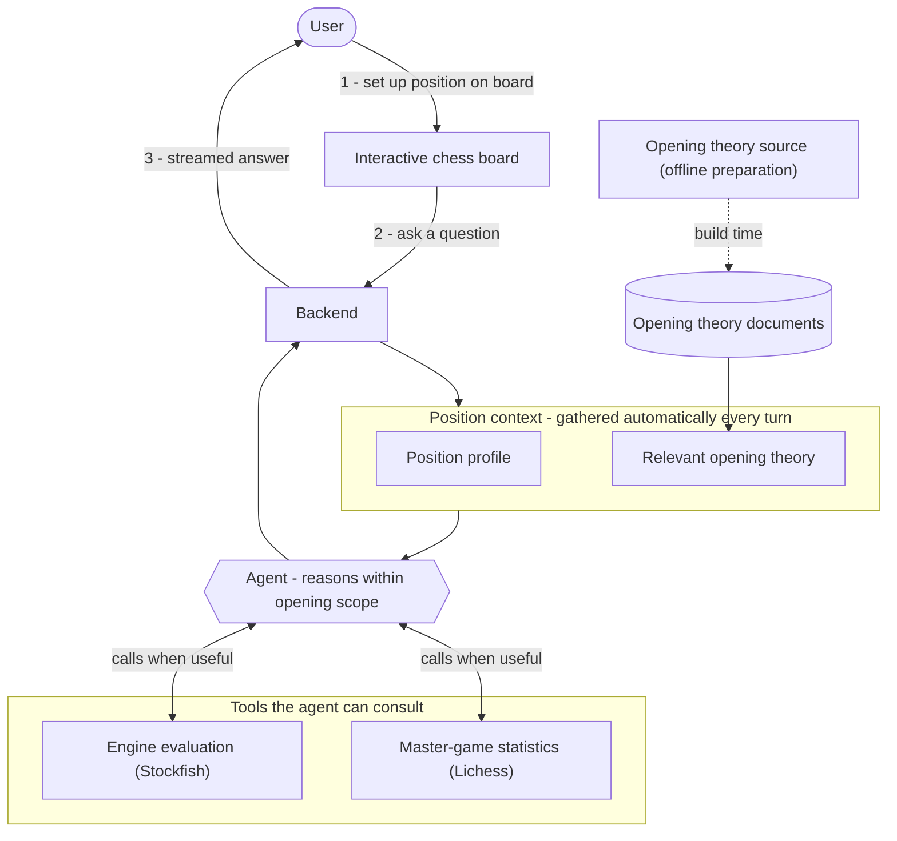

# ♟ Chess Opening Assistant

[](https://github.com/ktylus/chess_opening_assistant/actions/workflows/ci.yml)

An agentic assistant helping beginners and intermediate chess players explore ideas behind openings. Put a position on the board and engage in conversation.

LLMs are notoriously weak at calculating chess - so this assistant uses large volumes of absorbed commentary to explain ideas behind opening lines.


## Demo

TODO


## Highlights

- **Domain-specific retrieval, not default RAG.**
Chess positions are identified exactly by board state, so documents are matched on that rather than vector similarity - more precise than embeddings for a domain indexed by exact notation.
- **Scope boundary to control hallucination.**
The agent answers only within opening sequences (an 8-move limit, potentially deeper if a document is available) and declines otherwise - a deliberate decision to limit hallucination risk.
- **Evaluation, not vibes.**
An AI-as-judge scheme scores responses on correctness, completeness, and scope adherence against hand-written reference answers across 10 evaluation scenarios, plus per-example tool-use assertions - all tracked in LangSmith.
- **Agentic tool use.**
The model orchestrates Stockfish position evaluation and Lichess master-game statistics to ground its answers.


## How it works



Stack:
- LangChain - LLM integration, tool use
- FastAPI - interacting with the agent via REST API
- Pydantic - structured tool I/O and response schemas
- python-chess - move validation, chess engine support, PGN parsing
- LangSmith - evaluation logging/tracking, debugging

### Core idea

Despite well-known LLM limitations in chess understanding, popular chess openings have good coverage in training data, such as chess studies and didactic texts. Because of this, models can be useful as assistants in the process of trying to understand opening ideas.

Coming into the project, my idea was that a large model (Opus or Gemini Pro class) or even a mid-sized one would be able to navigate many popular (and some less popular) opening variants, along with short continuations or sidelines.

This proved to be correct - tested models (even smaller ones) were able to correctly explain common openings. Straying from popular lines or deep variants produced occasional hallucinations, including suggesting illegal moves.

### Document retrieval

Chess is a domain structured by the board state. Our documents retrieved are those that relate to the position currently on the board.

This way, retrieval ends up being more precise and cheaper than using embeddings.

### Evaluation

I created a set of 10 scenarios - user queries concerning a given chess position. These are graded using a judge model in an AI-as-a-judge scheme. For each example, the grader is guided by a reference answer authored by me.

Responses are scored on the following dimensions:
- Completeness
- Correctness
- Scope adherence

In addition to that, each evaluation example is labeled with a set of tools the agent is expected to use. Responses are graded on the tool use dimension - the agent passes for a given query if it uses required tools. Otherwise, the result is negative.

Prompts, model information and results are logged in LangSmith for experiment tracking.

Known limitations:
- Small eval set
- Use of the 1-5 score metric (hard to calibrate)
- Single judge model


## Usage

The project is split into a Python backend (FastAPI) and a React frontend (Vite),
each with its own dependency manifest and lockfile.

### Prerequisites

- [uv](https://docs.astral.sh/uv/) (Python tooling - manages the env and Python version)
- [Node.js](https://nodejs.org/) 18+ (ships with `npm`)
- A [Stockfish](https://stockfishchess.org/download/) binary for engine evaluation

### Environment variables

Create a `.env` file and fill out the details using `.env.example` as reference.

### Setup

One-time install of dependencies after cloning:

```bash
uv sync                  # build the Python .venv from uv.lock
cd frontend && npm ci    # install frontend deps from package-lock.json
```

### Running

Start the backend and frontend (in separate terminals):

```bash
uv run uvicorn backend.app.app:app --reload    # backend on http://localhost:8000
```

```bash
cd frontend && npm run dev     # frontend on http://localhost:5173
```

The Vite dev server proxies `/chat` to the backend on port 8000, so run both
together and open the frontend URL in your browser.


## Data Sources

- The opening document set was retrieved from the [Wikibooks Chess Opening Theory Book](https://en.wikibooks.org/wiki/Category:Book:Chess_Opening_Theory). (selected articles)
- [Lichess opening explorer](https://lichess.org/api#tag/opening-explorer) accessed through the API.


## Roadmap

### Move validation

I am planning to introduce a validation scheme ensuring that moves and variations suggested by the model are legal (consist of legal moves each step of the way). The main challenge is extracting suggested variations from LLM output accurately.

### Semantic retrieval

Semantic retrieval is considered as a supporting measure, but it's a challenge - retrieval relies on move variations which appear in standard algebraic notation. Thus, achieving high-quality retrieval would have to be done through matching concepts, ideas - something described in natural language, as opposed to chess notation.