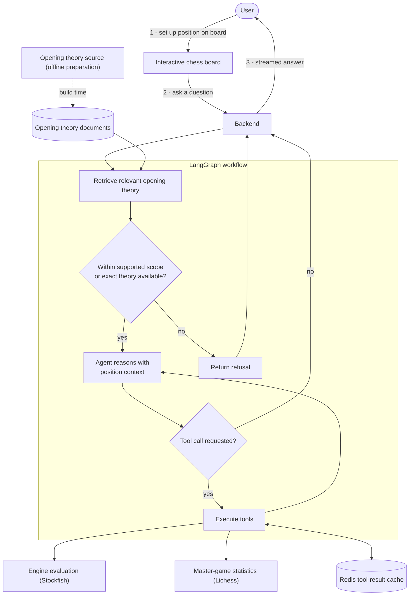

# ♟ Chess Opening Assistant

[](https://github.com/ktylus/chess_opening_assistant/actions/workflows/ci-cd.yml)

An agentic assistant helping beginners and intermediate chess players explore ideas behind openings. Put a position on the board and engage in conversation.

LLMs are notoriously weak at calculating chess, so this assistant uses large volumes of absorbed commentary to explain ideas behind opening lines.

**[Try it yourself](https://mnwjhbdxsk.eu-central-1.awsapprunner.com/)**

The service might be paused at times to keep the costs limited.
If it's down, the demo below covers basic usage.


## Demo

https://github.com/user-attachments/assets/3e86b36f-3328-430c-9836-bd5ac295330a


## Highlights

- **Domain-specific retrieval, not default RAG.**
Chess positions are identified exactly by board state, so documents are matched on that rather than vector similarity - more precise than embeddings for a domain indexed by exact notation. Utilizing a set of ~300 annotated opening lines.
- **Scope boundary to control hallucination.**
The agent answers only within opening sequences (an 8-move limit, potentially deeper if a document is available) and declines otherwise - a deliberate decision to limit hallucination risk.
- **Evaluation.**
An LLM-as-judge scheme scores responses on correctness, completeness, and scope adherence against hand-written reference answers across 10 evaluation scenarios, plus per-example tool-use assertions - all tracked in LangSmith.
- **Explicit agent workflow.**
LangGraph orchestrates document retrieval, scope enforcement, model reasoning, and tool calling as separate nodes with deterministic routing.


## How it works


```mermaid
flowchart TD
    User([User])
    User -->|"1 - set up position on board"| Board["Interactive chess board"]
    Board -->|"2 - ask a question"| API["Backend"]

    API --> Retrieval

    subgraph Workflow["LangGraph workflow"]
        Retrieval["Retrieve relevant opening theory"]
        Scope{"Within supported scope<br/>or exact theory available?"}
        Agent["Agent reasons with<br/>position context"]
        ToolCall{"Tool call requested?"}
        Tools["Execute tools"]
        Refuse["Return refusal"]

        Retrieval --> Scope
        Scope -->|"yes"| Agent
        Scope -->|"no"| Refuse
        Agent --> ToolCall
        ToolCall -->|"yes"| Tools
        Tools --> Agent
    end

    Docs[("Opening theory documents")] --> Retrieval
    Tools --> Stockfish["Engine evaluation (Stockfish)"]
    Tools --> Lichess["Master-game statistics (Lichess)"]
    Tools <--> Cache[("Redis tool-result cache")]

    ToolCall -->|"no"| API
    Refuse --> API
    API -->|"3 - streamed answer"| User

    Wiki["Opening theory source (offline preparation)"] -.->|build time| Docs
```

Stack:
- LangGraph - LLM workflow orchestration - state, routing, tool calling.
- LangSmith - evaluation logging/tracking, debugging
- FastAPI - interacting with the agent via REST API
- Pydantic - structured tool I/O and response schemas
- Docker Compose - running frontend and backend together, minimising setup
- Redis - caching Stockfish and Lichess tool results in local development (not yet in production)
- AWS - deployment with App Runner
- Terraform - AWS infrastructure as code
- GitHub Actions - CI/CD: testing/building, automated deployment from the main branch
- python-chess - move validation, chess engine support, PGN parsing

### Core idea

Despite well-known LLM limitations in chess understanding, popular chess openings have good coverage in training data, such as chess studies and didactic texts. Because of this, models can be useful as assistants in the process of trying to understand opening ideas.

Coming into the project, my idea was that a large model (Opus or Gemini Pro class) or even a mid-sized one would be able to navigate many popular (and some less popular) opening variants, along with short continuations or sidelines.

This proved to be correct - tested models (even smaller ones) were able to correctly explain common openings. Straying from popular lines or deep variants produced occasional hallucinations, including suggesting illegal moves.

### Document retrieval

Chess is a domain structured by the board state. Our documents retrieved are those that relate to the position currently on the board.

This way, retrieval ends up being more precise and cheaper than using embeddings.

### Evaluation

I created a set of 10 scenarios - user queries concerning a given chess position. These are graded using a judge model in an AI-as-a-judge scheme. For each example, the grader is guided by a reference answer authored by me.

Responses are scored on the following dimensions:
- Completeness
- Correctness
- Scope adherence

In addition to that, each evaluation example is labeled with the exact set of tools the agent is expected to use. Responses are graded on the tool use dimension: the agent passes only if it uses all and only those tools. Missing and unnecessary tools both result in a negative score.

Prompts, model information and results are logged in LangSmith for experiment tracking.

Known limitations:
- Small eval set
- Use of the 1-5 score metric (hard to calibrate)
- Single judge model


## Usage

The project is split into a Python backend (FastAPI) and a React frontend (Vite).
Docker Compose builds and runs both together - uv, Node, and Stockfish all live
inside the images, so nothing else needs installing.

### Prerequisites

- [Docker](https://docs.docker.com/get-docker/) (Docker Desktop bundles Compose)

### Environment variables

Create a `.env` file and fill out the details using `.env.example` as reference.

### Running

```bash
docker compose up --build      # build images and start both services
```

Open http://localhost:5173. Stop with `Ctrl-C`, or `docker compose down` to remove the containers.


## Deployment

The app is deployed on AWS App Runner. Images stored on AWS ECR, continuously deployed on successful Actions main branch pipeline passes. Infrastructure managed with Terraform.
Rate limits, API key spending limits and alarms set up to combat attacks abusing the underlying LLM.

Deployment happens on successful pushes to the main branch, after all tests pass. CI builds an image tagged with the commit hash, pushes it to ECR - that image is then used to update the deployed app.

While Redis caching is configured for local development, it is not yet there in the production environment.


## Data Sources

- The opening document set was retrieved from the [Wikibooks Chess Opening Theory Book](https://en.wikibooks.org/wiki/Category:Book:Chess_Opening_Theory). (selected articles)
- [Lichess opening explorer](https://lichess.org/api#tag/opening-explorer) accessed through the API.


## Roadmap

### Move validation

I am planning to introduce a validation scheme ensuring that moves and variations suggested by the model are legal (consist of legal moves each step of the way).

### Eval expansion

I am going to expand evaluation to more examples and change the 1-5 scale into binary pass/fail indication which is clearer.

### Implement Redis in production

Currently, Redis is set up only for the local development environment. I need to introduce it in production.